这是一个用于BizyAIR AI应用的ComfyUI插件（comfyui_bizyair），提供了用于与BizyAIR API服务集成的自定义节点。该插件允许用户通过BizyAIR的Web API远程调用AI服务。

## 架构

该插件遵循标准的ComfyUI自定义节点架构：

### 核心组件

- **BizyAIR.py**：包含所有节点类和实用函数的主插件文件
- **__init__.py**：ComfyUI插件初始化文件，包含节点映射和显示名称
- **check_requirements.py**：用于检查Python包依赖的实用脚本
- **requirements.txt**：最小依赖列表（httpx、requests、openai）

### 节点类

该插件实现了6种主要节点类型：

1. **BA_BizyAIR_Main**：用于发出Web应用请求的主要API接口节点
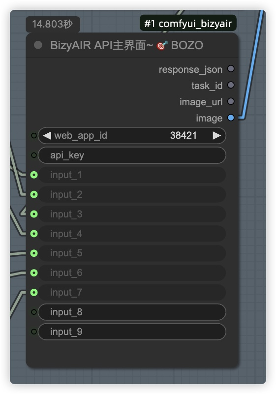

2. **BA_LoadImage**：支持base64和URL模式的图像输入节点
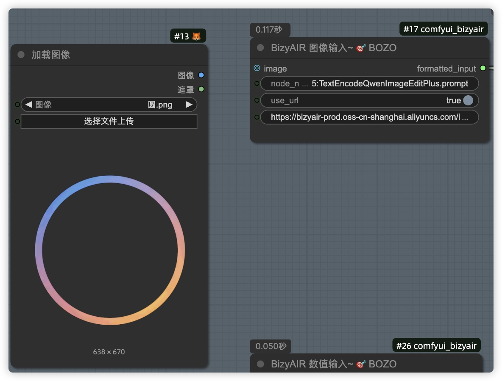
当启用**user_url**的时候，可以输入网络图片，不启用，可以image输入。
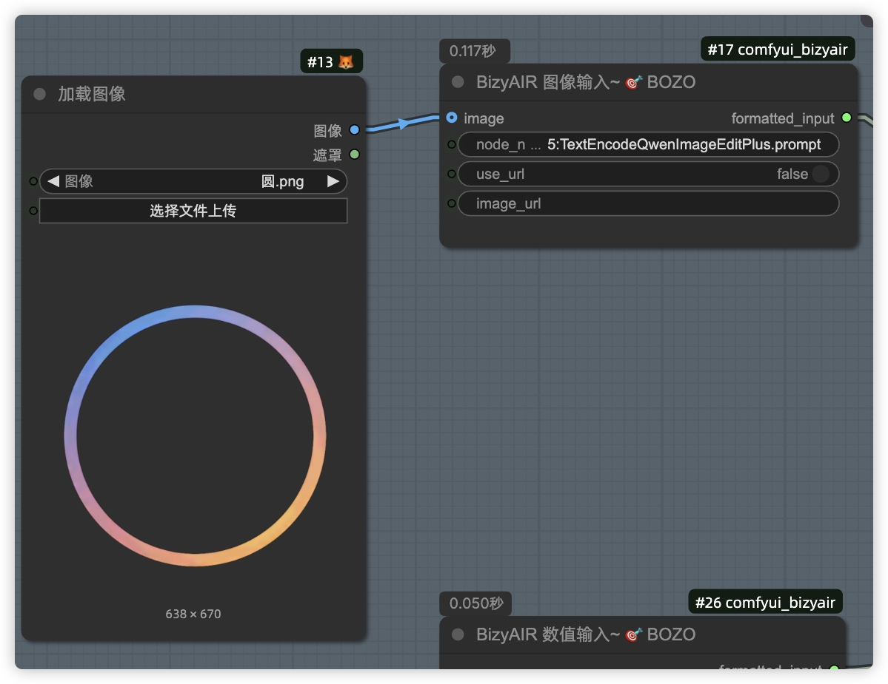


3. **BA_Float_Value**：具有浮点/整数选项的数值输入节点
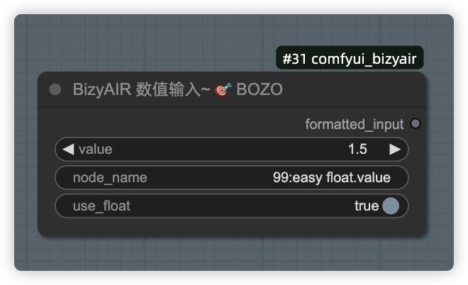
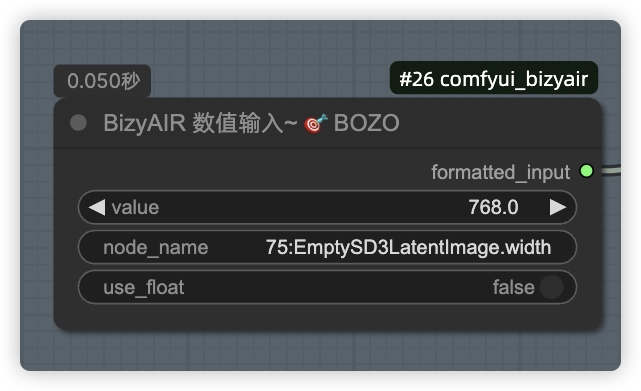

4. **BA_String_Value**：用于字符串参数的文本输入节点
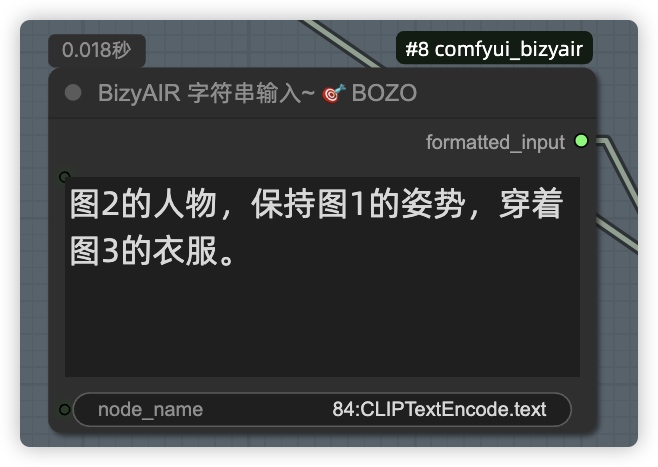

5. **BA_Image_Resizer**：用于尺寸调整的图像预处理节点
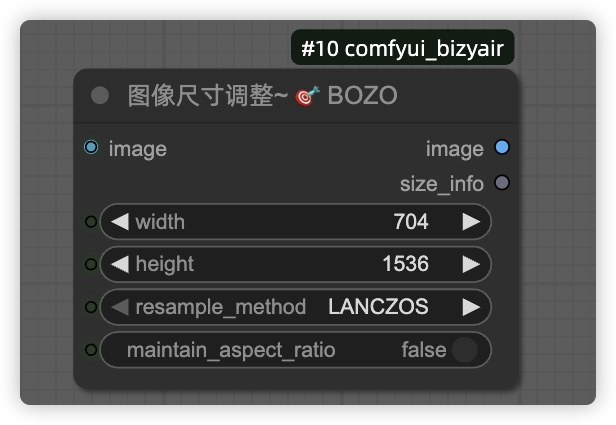
有多种图片调整方式，可以自定义测试下

6. **BA_Task_Status_Checker**：用于检查异步任务状态的节点
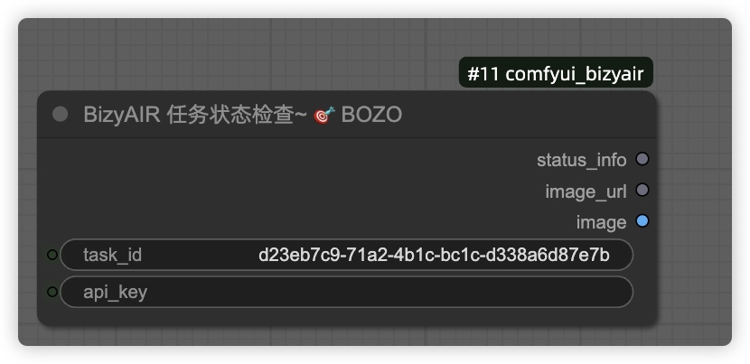


### 关键工具

- **图像处理**：用于在张量、PIL图像和base64编码之间进行转换的函数
- **API通信**：用于BizyAIR API集成的HTTP客户端，带有适当的错误处理
- **缓存系统**：本地图像缓存，避免重复下载
- **格式处理**：不同图像格式之间的自动转换（首选WebP）

## 开发命令

### 依赖管理
```bash
# 检查包要求和版本
python check_requirements.py

# 安装依赖（如有需要）
pip install -r requirements.txt
```

### 测试
目前没有实现正式的测试套件。测试通过ComfyUI界面进行。

## 配置

### API密钥设置
[官网Key密钥获取](assets/key.mp4)
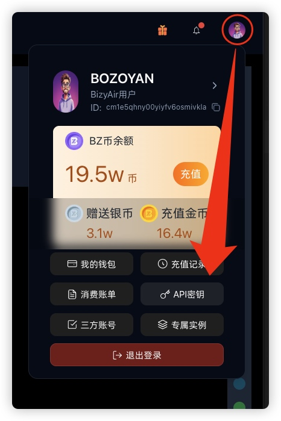
从https://bizyair.cn/官网上复制key，
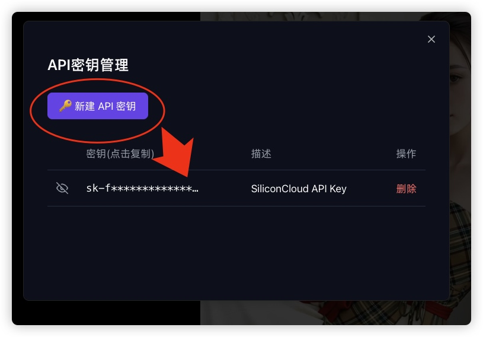
在插件目录内新建API密钥文件：
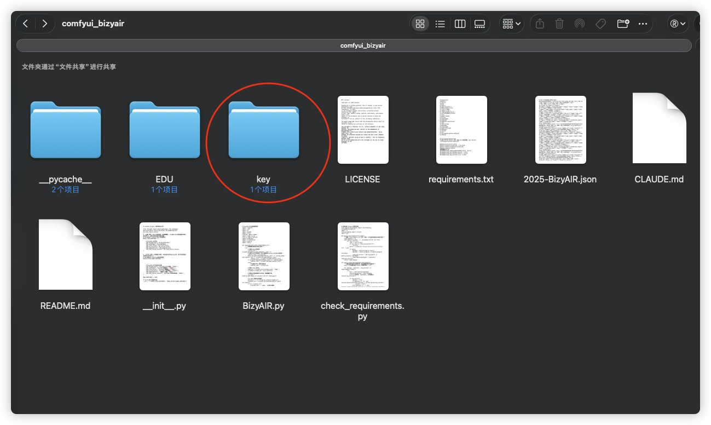
新建一个key文件夹，然后新建一个siliconflow_API_key.txt文件。将密钥输入进去。
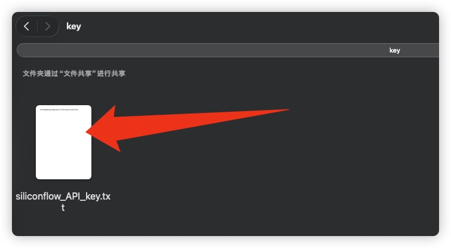
KEY的配置有两种方式：
1. `key/siliconflow_API_key.txt`（相对于插件目录）
2. 通过节点参数手动输入

### AI应用 官网操作
· 1、在BizyAIR官网上，找一个AI应用，比如这个**Qwen-image-2509 多图融合**。


· 2、查找API调用代码

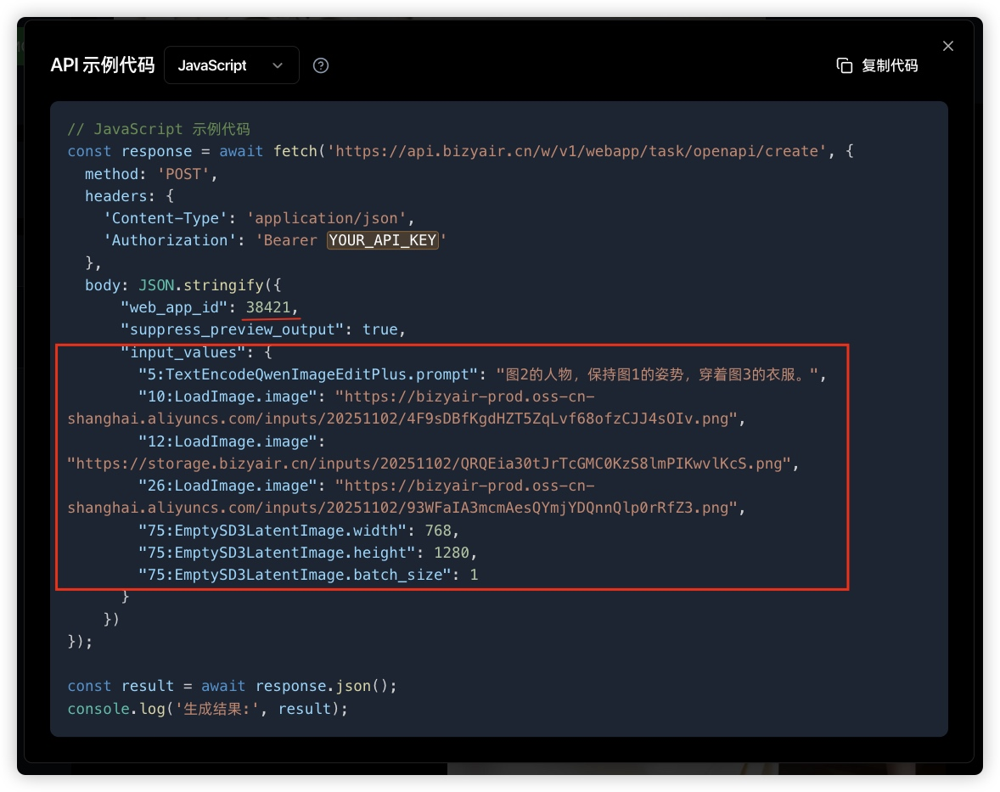
``` javascript
// JavaScript 示例代码
const response = await fetch('https://api.bizyair.cn/w/v1/webapp/task/openapi/create', {
  method: 'POST',
  headers: {
    'Content-Type': 'application/json',
    'Authorization': 'Bearer YOUR_API_KEY'
  },
  body: JSON.stringify({
      "web_app_id": 38421,
      "suppress_preview_output": true,
      "input_values": {
        "5:TextEncodeQwenImageEditPlus.prompt": "图2的人物，保持图1的姿势，穿着图3的衣服。",
        "10:LoadImage.image": "https://bizyair-prod.oss-cn-shanghai.aliyuncs.com/inputs/20251102/4F9sDBfKgdHZT5ZqLvf68ofzCJJ4sOIv.png",
        "12:LoadImage.image": "https://storage.bizyair.cn/inputs/20251102/QRQEia30tJrTcGMC0KzS8lmPIKwvlKcS.png",
        "26:LoadImage.image": "https://bizyair-prod.oss-cn-shanghai.aliyuncs.com/inputs/20251102/93WFaIA3mcmAesQYmjYDQnnQlp0rRfZ3.png",
        "75:EmptySD3LatentImage.width": 768,
        "75:EmptySD3LatentImage.height": 1280,
        "75:EmptySD3LatentImage.batch_size": 1
      }
    })
});

const result = await response.json();
console.log('生成结果:', result);
```
主要是在 comfyui 中填写 API 接口代码里面的**web_app_id**，以及**input_values** 的各个数据字段。
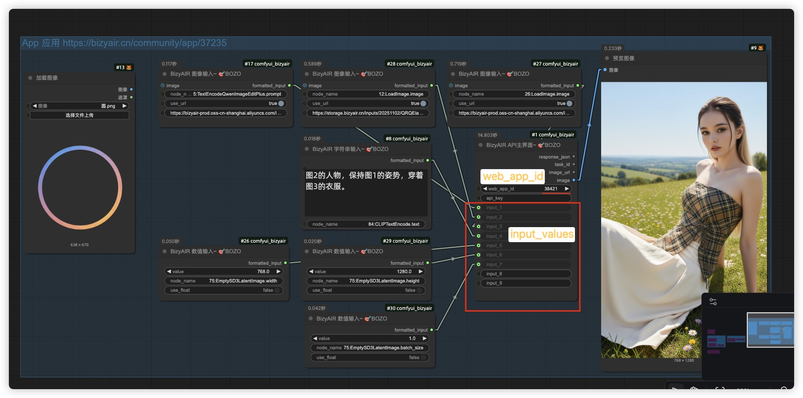
参考工作流： [2025-BizyAIR.json](assets/2025-BizyAIR.json)
**注意**
1，默认数字是整数，需要浮点，点开 **use_float** 就可以。
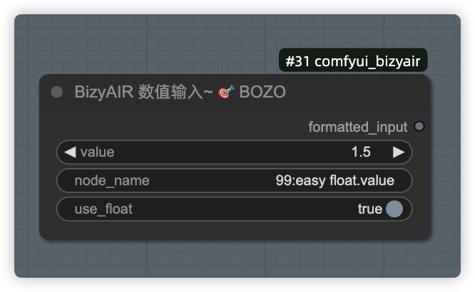2，图片的节点也是如此，有 **use_url** URL 图片启用。
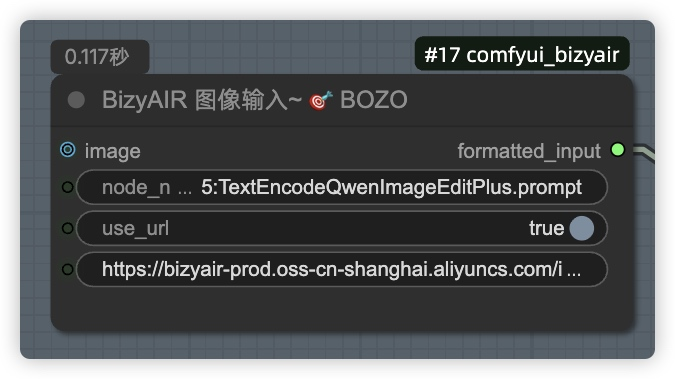


## 重要说明

- 插件使用中文分类名称："🇨🇳BOZO/BizyAir" 和 "🇨🇳BOZO/PIC"
- 图像格式标准化为WebP以用于API通信
- 所有张量操作均采用[批次、高度、宽度、通道]格式
- 错误处理包括详细日志，用于排查API故障
- 该插件支持同步API调用和异步任务状态检查


## 更新日志

- **（v1.0.0）初始发布，实现了BizyAIR上基本的AI应用的接口调用。
- **（v1.1.0）【未完成】简化接口，构想直接输入web_app_id自动生成节点面板调用。

## 📬 **联系与支持**

- **Issues**：[提交问题](https://github.com/bozoyan/comfyui_bizyair/issues)

感谢您使用 **comfyui_bizyair**！🎉  

目前项目的相关调用功能仍在不断完善中...

希望这款工具能为您带来便利。😊

---
## Star History

[](https://star-history.com/#bozoyan/comfyui_bizyair&Date)


